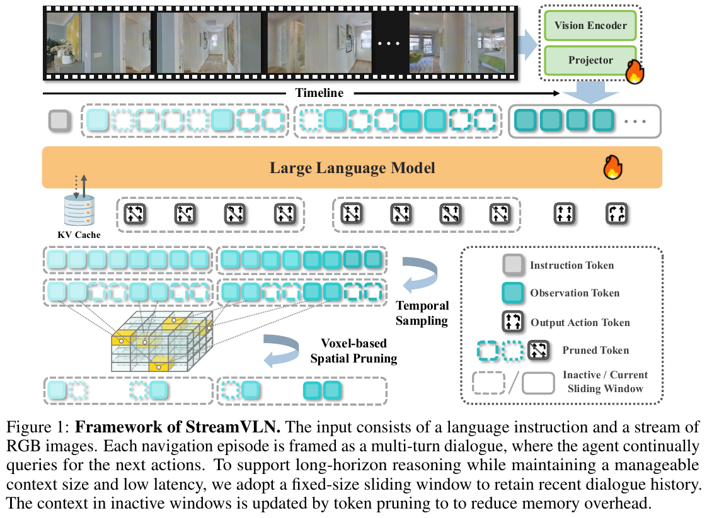

# StreamVLN 项目架构

## 项目概述
StreamVLN 是一个用于**视觉语言导航 (Vision-and-Language Navigation, VLN)** 的流式处理框架。它基于 **LLaVA-Video** 基础模型，通过 **SlowFast 上下文建模**（Fast-streaming 对话上下文 + Slow-updating 长期记忆）实现从连续视频输入中在线生成导航动作。该项目支持多轮对话形式的视觉、语言和动作交织建模，并可部署在实体机器人（如 Unitree Go2）上。

## 技术栈
- **编程语言**: Python 3.9+
- **深度学习框架**: PyTorch 2.1.2, Transformers, LLaVA-NeXT
- **仿真环境**: Habitat-sim 0.2.4, Habitat-lab
- **LLM 底座**: Qwen-2 (通过 LlavaQwen 实现)
- **视觉编码器**: SigLIP (或其他 CLIP 变体)
- **训练技术**: Dagger (Dataset Aggregation), SFT (Supervised Fine-Tuning), Co-training

## 项目结构

```
C:\GitHub\StreamVLN
├── config/                 # 配置文件 (训练、数据、VLN 任务)
├── llava/                  # 核心 LMM 架构 (继承并扩展自 LLaVA-NeXT)
│   ├── model/              # 模型定义 (LLM, 投影层, 编码器)
│   ├── train/              # 训练逻辑与 Trainer
│   └── eval/               # 评估脚本
├── streamvln/              # VLN 特定实现
│   ├── model/              # StreamVLNForCausalLM (SlowFast 建模逻辑)
│   ├── dataset/            # VLN 动作数据集加载 (交织数据格式)
│   ├── agent.py            # VLN 代理实现 (连接模型与环境)
│   ├── train.py            # 训练入口
│   └── eval.py             # 评估入口
├── realworld/              # 实体机器人部署相关代码
├── scripts/                # 训练和评估的 Shell 脚本
├── trl/                    # 强化学习相关工具 (针对 DPO 等)
└── requirements.txt        # 依赖项
```

## 核心组件

### 1. 模型层 (Model Layer)
- **位置**: `streamvln/model/stream_video_vln.py`
- **用途**: 实现支持流式输入的多模态大模型。
- **关键设计**:
  - **SlowFast 上下文建模**:
    - **Fast Context**: 当前时刻的视频帧，提供即时环境感知。
    - **Slow Context**: 历史观察的采样（记忆令牌 `<memory>`），通过空间池化（Spatial Pooling）减少 Token 数量，保留长期空间信息。
  - **状态管理**: 维护 `past_key_values` 和 `cache` 以支持流式推理和交织输入。

## 架构处理流程

<div align="center">
  
  <figcaption>Figure 1: StreamVLN 框架处理流程。输入包含指令和连续视频流，通过滑动窗口 KV Cache 维持 Fast Context，并使用基于 Voxel 的空间剪枝生成 Slow Context 记忆令牌。</figcaption>
</div>

### 处理步骤详细说明：
1. **指令与视频流输入**：模型接收自然语言指令和连续的 RGB 帧流。
2. **Fast-Streaming 窗口**：在活跃窗口内，使用滑动窗口 KV Cache 保留最近的对话历史，确保响应速度。
3. **Slow-Updating 记忆**：非活跃窗口的视觉 Token 经过时间采样和**基于 Voxel 的空间剪枝 (Voxel-based Spatial Pruning)**，压缩为稠密的记忆 Token。
4. **多模态推理**：LLM 整合指令、历史记忆和当前观察，自回归地生成动作序列。
5. **动作执行**：生成的动作（如 ↑, ←, →, STOP）直接用于导航控制。

### 详细模块处理流水线 (Pipeline)

根据代码实现（主要集中在 `streamvln_agent.py` 和 `stream_video_vln.py`），整个架构可分解为以下几个核心模块的串联协同：

#### 1. 传感器与环境交互模块 (Environment & Sensor Module)
- **功能**: 负责与仿真器（Habitat）或真实世界物理硬件（如 RealSense 相机）交互，获取实时观测数据。
- **输入**: 物理世界或仿真环境状态。
- **输出**:
  - `rgb`: 当前时刻的视觉图像帧 (H, W, 3)
  - `instruction_text`: 用户给定的自然语言导航指令
  - `pose` / `intrinsic`: 相机位姿与内参

#### 2. 多模态预处理模块 (Multimodal Preprocessing Module)
- **功能**: 将原始视觉和文本数据转换为模型可接受的 Tensor 格式，并动态构建交织对话模板（包含 `<image>` 和 `<memory>` 特殊占位符）。
- **输入**: 原始 RGB 图像、历史指令及当前系统状态。
- **输出**:
  - `pixel_values`: 经过 `SigLipImageProcessor` 处理的视觉张量。
  - `input_ids`: 经过 `Qwen` Tokenizer 处理的文本指令及对话历史 ID，其中特定的位置被替换为 `IMAGE_TOKEN_INDEX` 或 `MEMORY_TOKEN_INDEX`。

#### 3. 记忆与状态管理模块 (Memory & State Management Module)
- **功能**: 决定哪些历史帧应作为 Slow Context（记忆）保留，哪些帧属于 Fast Context（当前窗口）。在 `encode_rgbd` 中实现空间压缩（如 2D Pooling 或 Voxel Pruning）。
- **输入**: 历史图像序列 (`rgb_list`)、时间戳 (`time_ids`)。
- **输出**:
  - `memory_features`: 经过投影和池化降维的历史记忆特征向量，用于替换 Prompt 中的 `<memory>` Token。
  - `past_key_values`: 缓存的 KV 状态，用于加速流式生成。

#### 4. SlowFast LLM 推理核心 (SlowFast Core Model)
- **功能**: 结合 `Qwen2ForCausalLM` 和视觉编码器（继承自 LLaVA 架构）。处理多模态交织序列，利用前置缓存（KV Cache）高效进行自回归解码。
- **输入**:
  - 融合了 `image_features` 和 `memory_features` 的 `inputs_embeds`。
  - 历史的 `past_key_values`。
- **输出**:
  - `output_ids`: LLM 自回归生成的连续文本 Token ID 序列。

#### 5. 动作解析与控制模块 (Action Parsing Module)
- **功能**: 将大语言模型输出的自然语言（符号）映射为机器人可执行的低级离散控制指令。由 `VLNEvaluator.parse_actions()` 实现。
- **输入**: `llm_outputs` (如文本："↑←↑")。
- **输出**:
  - `action_seq`: 离散动作索引列表（如 `[1, 2, 1]`，分别对应前进、左转、前进）。该序列被送回环境模块以驱动机器人物理移动。

### 2. 代理层 (Agent Layer)
- **位置**: `streamvln/streamvln_agent.py`
- **用途**: `VLNEvaluator` 类负责在仿真环境或现实世界中执行推理循环。
- **关键文件**:
  - `step()`: 接收 RGB 输入，调用模型生成动作序列，并管理对话历史。
  - `parse_actions()`: 将模型输出的文本解析为离散的导航动作（前进、左转、右转、停止）。

### 3. 数据层 (Data Layer)
- **位置**: `streamvln/dataset/vln_action_dataset.py`
- **用途**: 将 VLN 轨迹数据转换为模型可理解的交织对话格式。
- **关键逻辑**:
  - `prepare_conversation()`: 将动作序列、指令和视觉观察（当前+历史）组装成多轮对话。
  - 自动插入 `<image>` 和 `<memory>` 占位符。

### 4. 训练与分布式逻辑
- **位置**: `streamvln/streamvln_train.py`, `scripts/`
- **用途**: 支持多机多卡训练、Dagger 收集和多阶段协同训练（Co-training）。

## 架构模式
- **基于 Transformer 的因果语言模型 (Causal LM)**: 将导航视为一种翻译任务，将“指令+视觉流”翻译为“动作流”。
- **流式架构**: 采用滑动窗口 KV Cache 和历史记忆令牌，平衡了计算效率与长程上下文建模。

## 数据流
1. **输入**: 环境提供 RGB 图像，用户提供自然语言指令。
2. **处理**: `VLNEvaluator` 收集图像序列，根据 `num_history` 提取历史帧作为记忆，根据 `num_future_steps` 处理当前帧。
3. **推理**: 模型接收 `[指令 + 历史记忆 + 当前视觉]`，输出后续的动作文本。
4. **执行**: 动作文本被解析为控制指令（如左转 15 度），反馈给机器人或仿真器。

## 关键设计决策
- **Memory Token (<memory>)**: 不直接在 Prompt 中堆叠所有历史帧，而是通过采样和 2D 池化压缩历史信息，显著降低显存占用和计算延迟。
- **交织建模 (Interleaved Modeling)**: 动作被视为一种特殊的文本 Token，与其他多模态信息（图像、记忆）在同一个 Embedding 空间中处理。
- **Real-world 对齐**: 针对物理部署优化了动作平滑度（如移除冗余的初始旋转）。

## 技术深度解析 (Q&A)

### Q1: 基于 Voxel 的 3D 空间剪枝是如何减少长程记忆压力的？
**解析**：
StreamVLN 引入了 **Voxel-based Spatial Pruning** 来解决视频 Token 线性增长的问题。其核心是将 2D 视觉 Patch 映射到其对应的 **3D 物理位置** 进行去重：

- **映射原理 (Back-projection)**：利用深度和位姿将视觉 Token 量化到 3D 世界坐标系的离散体素索引 $V_{idx}$ 中。
- **空间去重逻辑**：即使机器人在不同位置观察（相机位置变动），看向同一物理目标产生的 Token 都会映射到相同的 $V_{idx}$，系统只保留该位置最新的视觉特征。
- **特征利用 (Utilization)**：
  1. **转化为记忆 Token**：剪枝后的体素特征被序列化，并关联到提示词中的 **`<memory>`** 占位符。
  2. **作为慢速上下文 (Slow Context)**：这些特征作为 LLM 输入序列的一部分，通过注意力机制 (Attention) 供模型随时检索。
  3. **空间推理**：当指令涉及“回头”或“去之前看过的位置”时，模型通过检索这些持久化的 3D 物理特征，实现超越滑动窗口限制的长程导航决策。
- **核心优势**：
  1. **显存友好**：Token 规模与“探索到的空间大小”成正比，而非与“导航时间”成正比。
  2. **固定预算 (Fixed Budget)**：在代码实现中，系统通过**均匀稀疏采样 (Sparse Sampling)** 确保送入 LLM 的 `<memory>` Token 数量是恒定的（由 `num_history` 参数控制）。
  3. **恒定推理延迟**：由于上下文窗口总长度被限制在固定规模（如 4096 Token），推理速度不会随着地图变大或时间增加而衰减，从而保证了实时部署的稳定性。


### Q2: 滑动窗口 KV Cache (Sliding Window KV Cache) 如何实现流式推理？
**解析**：
为了实现实时交互，StreamVLN 采用了 **Sliding Window KV Cache** 机制来精确控制 **快速推理上下文 (Fast Context)** 的规模：

- **规模控制**：模型在显存中仅维护一个固定长度的滑动窗口（例如最近 $N$ 帧）。这防止了 KV Cache 随导航时间线性增长，从而将每步推理的 Prefilling 时间降低了 99% 以上，确保了恒定的响应速度（<0.3s）。
- **缓存离场与记忆接力**：
  1. **离场**：当对话或视觉帧超出窗口范围时，其占用的高维 KV 状态会被从活跃缓存中移除。
  2. **固化**：这些“离场”的视觉信息并非被简单丢弃，而是通过 3D 空间剪枝压缩为 `<memory>` Token。
- **性能优势**：这种设计使得模型能够“轻装上阵”，在处理当前紧急动作（如“即刻左转”）时反应极快，同时又不失去对全局环境的认知。

### Q3: 为什么模型需要交织 (Interleaved) 的训练数据？
**解析**：
StreamVLN 的 `VLNActionDataset` 将导航任务建模为指令、图像序列和动作 ID 的交织流。
- **多任务协同**：通过同时学习通用视频描述（LLaVA-Video）、3D 问答（ScanQA）和导航数据，模型获得了更强的空间推理能力。
- **统一表示**：动作被视为特殊的文本 Token，直接参与自回归预测。这种统一的表示学习使得模型能够利用大语言模型的强理解能力来处理复杂的导航指令（如“在看到黑伞后左转”）。

### Q4: 协同训练 (Co-training) 的多阶段构成是怎样的？
**解析**：
StreamVLN 的协同训练采用分阶段演进的策略，旨在平衡导航技能与通用空间推理能力：
- **第一阶段：能力初始化 (Base SFT)**：在 R2R/RxR 等标准数据集上进行监督细调，初步建立“指令-视觉-动作”的映射关系。
- **第二阶段：DAgger 交互增强**：采用 **DAgger (Dataset Aggregation)** 算法。在仿真环境中运行模型，当其偏离路径时由专家策略给出纠错动作。这种“模型犯错+专家纠错”的数据显著提升了模型在未见环境中的鲁棒性。
- **第三阶段：多源协同训练 (Co-training)**：
  - **多维数据融合**：将导航轨迹与通用视觉语言数据（MMC4）、3D 空间问答（ScanQA/SQA3D）混合训练。
### Q5: 什么是 DAgger (Dataset Aggregation) 算法？它解决了什么问题？
**解析**：
DAgger 是一种迭代式的模仿学习算法，旨在解决自动驾驶和机器人导航中常见的**“分布偏移 (Distributional Shift)”**或**“级联错误”**问题。

- **核心矛盾**：在仅使用专家数据训练（行为克隆）时，模型一旦在执行中产生微小偏差，就会进入训练集中未涵盖的未知状态，导致错误不断累积直至失败。
- **算法流程**：
  1. **执行 (Rollout)**：让当前模型在环境中实际运行。
  2. **标注 (Labeling)**：对模型访问的每一个状态（包括走偏的状态），请求“专家”给出正确的补救动作。
  3. **聚合 (Aggregation)**：将这些包含“错误状态与纠错动作”的新数据并入原始数据集。
  4. **再训练 (Retrain)**：更新模型参数，使其学会如何从错误中恢复。
- **在项目中的作用**：
  - StreamVLN 通过第二阶段的 DAgger 训练，让模型在仿真器中经历了数十万次“走偏-纠错”的循环。
  - 这使得模型具备了极强的**鲁棒性 (Robustness)**，即使在现实部署中受到传感器噪点或环境干扰，也能自动调整路径重新回到预定路线上，而不至于“一失足成千古恨”。


